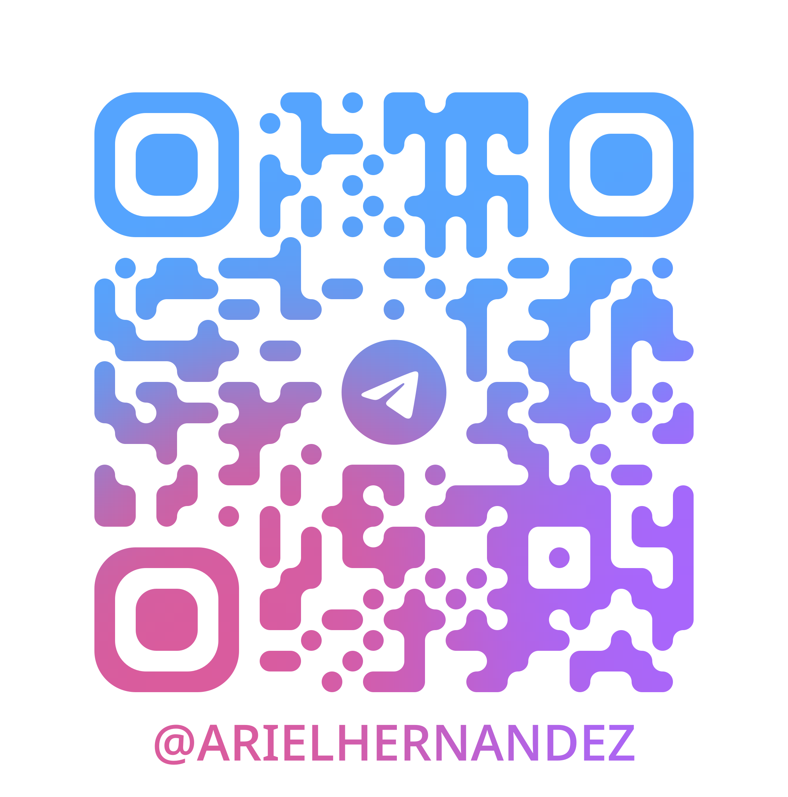

# Hola, soy Ariel Hernández 👋

  
  &nbsp;&nbsp;&nbsp;
  

### Sobre Mí

Soy un desarrollador de software apasionado por [**Menciona tu área, ej: el desarrollo web, la ciberseguridad, el análisis de datos**] con base en Chile 🇨🇱. Me encanta enfrentar nuevos desafíos y aprender constantemente sobre las últimas tecnologías. Actualmente, estoy enfocado en [**Menciona en qué estás trabajando o aprendiendo, ej: mejorar mis habilidades en React y Node.js**].

---

### 🛠️ Mi Stack Tecnológico

  
  
  
  
  
  
  
  
  
  
  

---

### 📫 Contáctame

  
  
  
  

  
💬 Para una comunicación más directa, escanea este QR de Telegram

   
  

